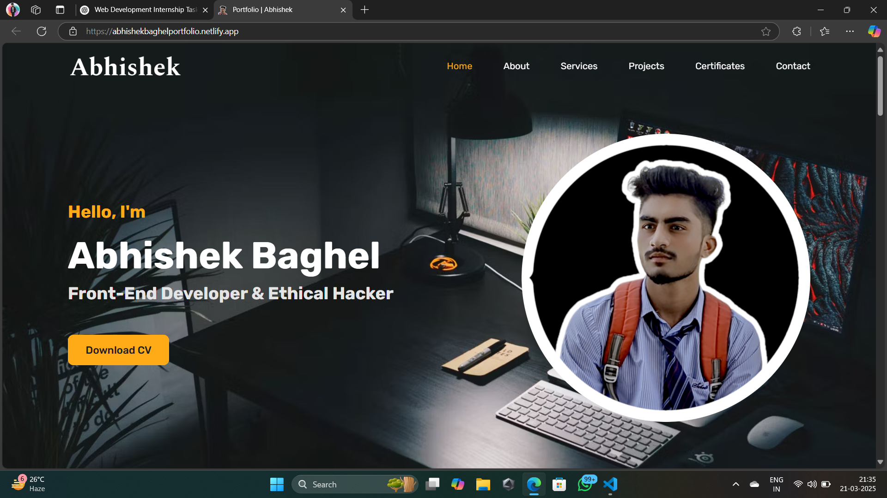

# Abhishek's Portfolio Website



## 🚀 Project Overview
This is a **personal portfolio website** showcasing my skills, projects, and achievements. It serves as an online resume, helping potential recruiters and collaborators learn more about my work.

## 🔥 Features
- **About Section** – A brief introduction about me
- **Skills & Services** – Highlights my technical and non-technical expertise
- **Projects Showcase** – Displays my best projects with descriptions and links
- **Certificates Section** – Showcases my certifications with preview and links
- **Contact Form** – Allows visitors to reach out via email
- **Fully Responsive Design** – Works perfectly on mobile, tablet, and desktop
- **Dark Themed UI** – Aesthetic and modern interface

## 🛠️ Technologies Used
- **Frontend:** HTML, CSS (Tailwind + Bootstrap), JavaScript
- **Icons & Fonts:** Font Awesome, Google Fonts
- **Form Handling:** EmailJS for contact form submissions
- **Hosting & Deployment:** GitHub Pages / Netlify

## 📂 Installation & Usage
To run the portfolio website locally:

1. **Clone the repository:**
   ```sh
   https://abhikiing.github.io/GrowthLink-Project/
   ```
2. **Navigate to the project directory:**
   ```sh
   cd portfolio-website
   ```
3. **Open `index.htm` in your browser**

## 🌐 Live Demo
🔗 **[Click here to view live portfolio](https://abhikiing.github.io/GrowthLink-Project/)**

## 📧 Contact Me
If you have any queries, feel free to reach out:
- **Email:** abhishekbaghelagra@gmail.com
- **LinkedIn:** [linkedin.com/in/abhishek](https://www.linkedin.com/in/abhishek-baghel-082a09282/?utm_source=share&utm_campaign=share_via&utm_content=profile&utm_medium=android_app)
- **GitHub:** [github.com/abhishek](https://github.com/abhikiing)

---
⭐ If you like this project, give it a **star** on GitHub!
